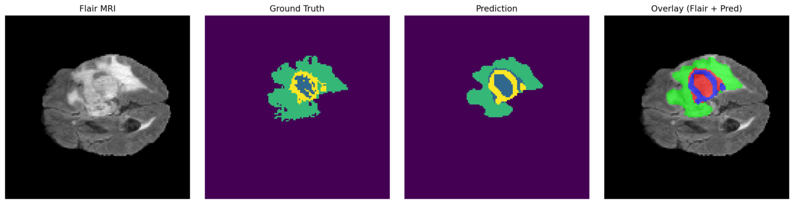
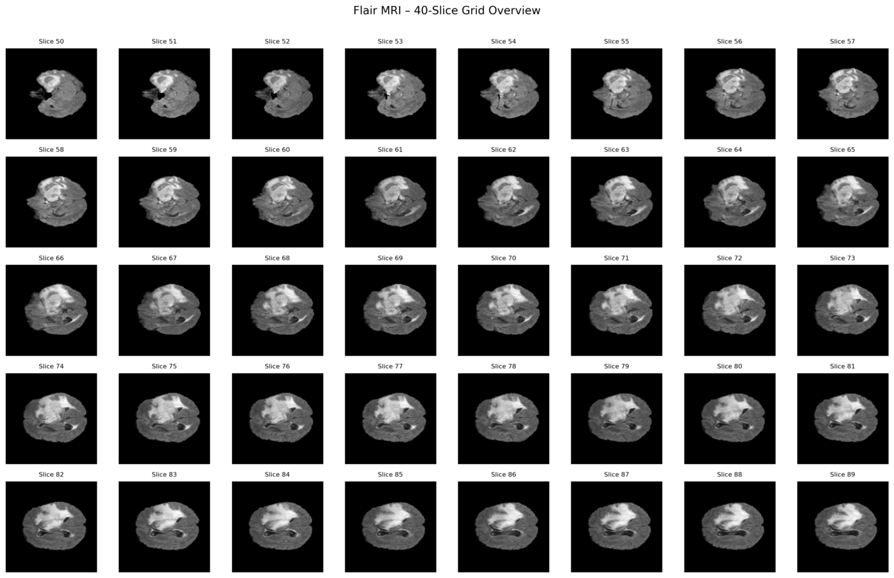
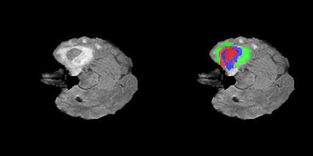
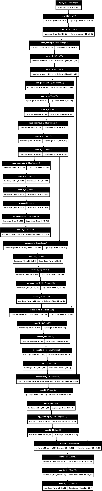

# 🧠 Brain MRI Tumor Segmentation System

A deep learning–based system for detecting and segmenting brain tumors from MRI scans using a U-Net architecture. This project processes multi-modal MRI data and generates visual outputs including overlays, grids, and GIFs for better interpretation.

---

## 🚀 Features

- Automatic Tumor Segmentation using U-Net
- Supports FLAIR + T1CE MRI modalities
- Multi-class prediction:
  - Background
  - Necrotic Core
  - Edema
  - Enhancing Tumor
- Visualization outputs:
  - Slice-wise segmentation
  - Grid view
  - GIF animation

---

## 📸 Outputs

### Sample Output


### Grid Visualization


### Prediction Animation


### Model Architecture


---

## 🏗️ Model Architecture

- U-Net (Encoder–Decoder CNN)
- Input: (128, 128, 2)
- Output: (128, 128, 4)
- Uses Conv2D, MaxPooling, UpSampling, Skip Connections

---

## ⚙️ Tech Stack

- Python
- TensorFlow / Keras
- OpenCV
- NumPy
- Streamlit

---

## 📂 Project Structure

```
├── app.py
├── model.keras
├── output01.png
├── outputgrid.png
├── output.gif
├── model.png
├── notebook.ipynb
├── utils/
├── data/
└── README.md
```

---

## 🔄 Workflow

1. Load MRI volumes (.nii)
2. Preprocess slices (resize + normalize)
3. Run U-Net model
4. Generate segmentation masks
5. Convert to overlay
6. Visualize results

---

## ⚠️ Setup Instructions (Important)

### Model Setup

1. Run the training notebook (.ipynb) completely
2. Select the best model based on validation accuracy or Dice score
3. Save the model:
  
  ```
  model.save("model.keras")
  ```
  
4. Replace the model in app.py with your trained model

---

### Environment Requirements

- TensorFlow 2.19
- CUDA installed (GPU support)
- cuDNN compatible version

---

### GPU Check

```
nvidia-smi
```

If GPU is not detected, the app will run on CPU (slow).

---

## ▶️ Run the Project

```
git clone https://github.com/your-username/your-repo.git
cd your-repo
pip install -r requirements.txt
streamlit run app.py
```

---


## 👨‍💻 Author

Sai Venkata Sandeep